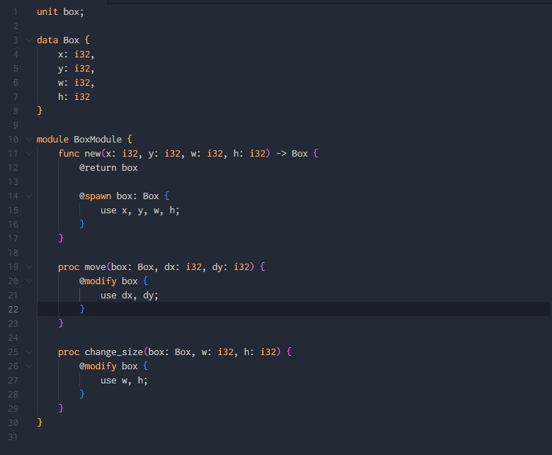

**Now,Currently under development.**

# 💡SysDC-VSCode-Syntax

This is syntax highlight extension of [SysDC](https://github.com/Yuta1004/SysDC) in VS Code.    

## ✅Features

* This can highlight the SysDC source code.

## ✅Requirements

Nothing.

## ✅Extension Settings
Now,Nothing.

## 🏗Dev
### Debug
Open this repository in VS Code and run.    

## 🔨Release Notes
Now,Nothing.

## 🔍For more information

* [Repository of this](https://github.com/PenguinCabinet/SysDC-VSCode-Syntax)

## 🎫LICENSE
[MIT LICENSE](./LICENSE)

## ✍Author

[PenguinCabinet](https://github.com/PenguinCabinet)

